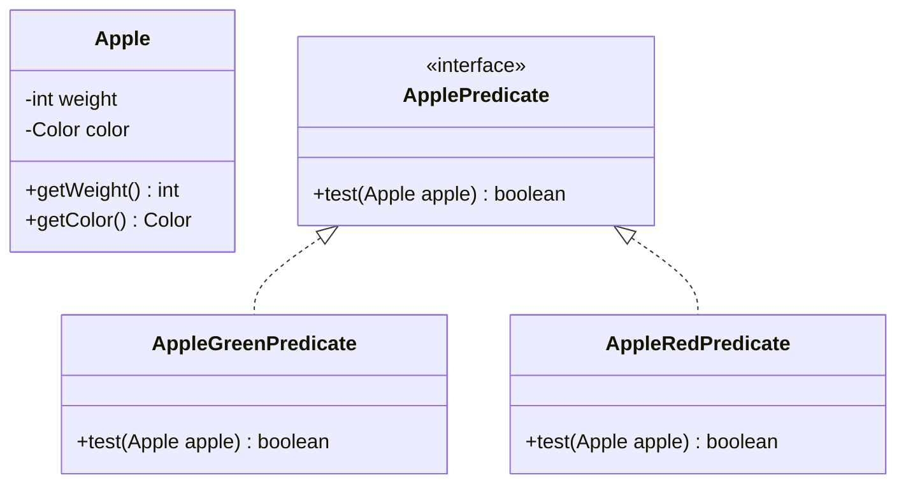

# Chapter 2 동작 파라미터화로 코드 전달하기  
## 목차
[2.1. 변화하는 요구 사항에 대응하기](#21-변화하는-요구사항에-대응하기)    
* [2.1.1 첫번째 시도 : 녹색사과 필터링](#211-첫번째-시도--녹색-사과-필터링)
* [2.1.2 두번째 시도 : 색을 파라미터화](#212-두번째-시도--색을-파라미터화)
* [2.1.3 세번째 시도 : 가능한 모든 속성을 필터링](#213-세번째-시도--가능한-모든-속성으로-필터링)


[2.2. 동작 파라미터화](#22-동작-파라미터화)
* [2.2.1 네번째 시도 : 추상적 조건으로 필터링]()

[2.3. 복잡한 과정 간소화](#23-복잡한-과정-간소화)
* [2.3.1 익명클래스](#231-익명클래스)
* [2.3.2 다섯번째 시도 : 익명클래스 사용](#232-다섯번째-시도--익명클래스-사용)
* [2.3.3 여섯번째 시도 : 람다표현식 사용](#233-여섯번째-시도--람다표현식-사용)
* [2.3.4 일곱번째 시도 : 리스트 형식으로 추상화](#234-일곱번째-시도--리스트-형식으로-추상화)

[2.4. 실전예제](#24-실전예제)
* [2.4.1 comparator로 정렬하기](#241-comparator로-정렬하기)
* [2.4.2 runnable로 코드 블록 실행하기](#242-runnable로-코드-블록-실행하기)

*** 

- 변화하는 요구사항은 소프트웨어 엔지니어링에서 피할수 없는 문제다. 
- 시시각각 변하는 요구사항에 대응 할 때 엔지니어링의 비용을 가장 최소화할 수 있으면 좋을 것이다. 
- 새롭게 추가한 기능은 **쉽게 구현** 할 수 있어야 하고 장기 적인 관점에서 **유지보수가 쉬워야 한다**. 
- 동작 파라미터화를 이용하면 자주 바뀌는 요구사항에 효과적으로 대응할 수 있다. 
- 동작 파라미터화란 아직 어떻게 실행할 것인지 결정하지 않은 코드 블록을 의미하고 나중에 호출 하기 때문에 실행은 나중으로 미뤄진다. 

## 2.1 변화하는 요구사항에 대응하기
### 2.1.1 첫번째 시도 : 녹색 사과 필터링

```java
enum Color {
    RED, 
    GREEN 
}

// 녹색 사과 
public static List<Apple> filterGreenApples(List<Apple> invertory){

    List<Apple> result = new ArrayList<>();
    
    for (Apple apple : invertory) {
        if(GREEN.equals(apple.getColor())){
            result.add(apple);
        }
    }
    return result;
}

// 빨간 사과
public static List<Apple> filterRedApples(List<Apple> invertory){
        
        List<Apple> result = new ArrayList<>();
        for (Apple apple : invertory) {
            if(RED.equals(apple.getColor())){
                result.add(apple);
            }
        }
        return result;
}
``` 
- 위 코드를 통해서 녹색 사과 및 빨간 사과를 필터링 하는 것이 가능하지만 다양한 색을 필터링하는 등의 변화에 대응하기 어렵다. 

- **거의 비슷한 코드가 반복 존재한다면 그 코드를 추상화한다**.

### 2.1.2 두번째 시도 : 색을 파라미터화 
- 메서드에 파라미터를 추가하면 변화하는 요구사항에 조금 더 유연하게 대응할 수 있다. 
- 변하는 값을 외부에서 인자로 받아서 처리하는 값 파라미터화(Value Paremeterization)?  
```java
public static List<Apple> filterApplesByColor(List<Apple> inventory, Color color){
    
    List<Apple> result = new ArrayList<>();
    
    for (Apple apple : inventory) {
        if(color.equals(apple.getColor())){
            result.add(apple);
        }
    }
    return result; 
}

public static List<Apple> filterApplesByWeight(List<Apple> inventory, int weight){
    List<Apple> result = new ArrayList<>();
    for (Apple apple : inventory) {
        if(apple.getWeight() > 150){
            result.add(apple);
        }
    }
    
    return result;
}
```
- 무게 필터링 조건을 적용하는 부분의 코드가 색 필터링 코드와 대부분 중복된다. 
- 이는 소프트웨어 공학의 DRY 원칙을 어기는 것이다. 
### 2.1.3 세번째 시도 : 가능한 모든 속성으로 필터링 
```java
public static List<Apple> filterApples(List<Apple> inventory, 
                                       Color color, 
                                       int weight, 
                                       boolean flag){

    List<Apple> result = new ArrayList<>();
    
    for (Apple apple : inventory) {
        if((flag && apple.getColor().equals(color)) || 
            (!flag && apple.getWeight() > weight)){
            result.add(apple);
        }
    }
    
    return result;
}

```
*** 

## 2.2 동작 파라미터화
- 참 또는 거짓을 반환하는 함수를 프레디케이트라고 한다. 
```java
public interface ApplePredicate {
    boolean test(Apple apple);
}
```

- 위 조건에 따라 filter 메서드가 다르게 동작하는데 이를 전략 디자인 패턴이라고 한다. 
- 전략 디자인 패턴은 각 알고리즘을 캡슐화하는 알고리즘 패밀리를 정의해둔 다음에 런타임에 알고리즘을 선택하는 기법이다. 
- filterApples 메서드가 ApplePredicate 객체를 인수로 받도록 고친다. 

### 2.2.1 네번째 시도 : 추상적 조건으로 필터링
```java
public class AppleGreenColorPredicate implements ApplePredicate{

    @Override
    public boolean test(Apple apple) {
        return GREEN.equals(apple.getColor());
    }
}

public class AppleRedColorPredicate implements ApplePredicate{

    @Override
    public boolean test(Apple apple) {
        return RED.equals(apple.getColor());
    }
}

public static List<Apple> filterApplesPredicate(List<Apple> inventory, ApplePredicate predicate){
    List<Apple> result = new ArrayList<>();

    for (Apple apple : inventory) {
        if(predicate.test(apple)){
            result.add(apple);
        }
    }
    
    return result;
}

```
- 컬렉션 탐색 로직과 각 항목에 적용할 동작을 분리할 수 있다는 것이 동작파라미터의 강점이다. 
- 하나의 메서드가 다른 동작을 수행할 수 있도록 재활용 할 수 있으며 유연한 API를 만들때 동작 파라미터화가 중요한 역할을 한다. 

***
## 2.3 복잡한 과정 간소화 
- 사용하기 복잡한 기능, 개념을 사용하고 싶은 사람은 없다. 
- 현재 filterApples메서드로 새로운 동작을 전달하려면 ApplePredicate 인터페이스를 구현하는 여러 클래스를 정의 후 인스턴스화 해야 한다. 
- 자바는 클래스의 선언과 인스턴스화를 동시에 수행할 수 있는 익명 클래스라는 기법을 제공한다. 
- 익명 클래스를 이용하면 코드의 양을 줄일 수 있다. 

#### 2.3.1 익명클래스 
- 익명 클래스는 자바의 지역 클래스와 비슷한 개념이다. 말 그대로 이름이 없는 클래스를 의미한다. 

#### 2.3.2 다섯번째 시도 : 익명클래스 사용
```java
List<Apple> redApples = filterApplesPredicate(inventory, new ApplePredicate() {
    public boolean test(Apple apple){
        return RED.equals(apple.getColor());
            }
    });
```
- 익명 클래스 역시 많은 양을 차지 하고 익명 클래스 사용에 익숙하지 않다. 
- 코드의 장황함은 구현과 유지보수에 시간이 오래 걸린다. 
- 익명 클래스로 인터페이스를 구현 하는 여러 클래스를 선언하는 과정을 조금 줄일 수 있지만 있지만 새로운 동작을 정의하는 메서드를 구현해야 한다는 점은 변하지 않는다. 

#### 2.3.3 여섯번째 시도 : 람다표현식 사용
- 자바 8의 람다를 사용하면 간단하게 재구현 할 수 있다. 
```java
List<Apple> result = filterApples(inventory, (Apple apple) -> RED.equals(apple.getColor()));
```
#### 2.3.4 일곱번째 시도 : 리스트 형식으로 추상화 
```java
public static <T> List<T> filter(List<T> inventory, Predicate<T> predicate){
    List<T> result = new ArrayList<>();

    for (T apple : inventory) {
        if(predicate.test(apple)){
            result.add(apple);
        }
    }
    
    return result;
}

List<Apple> result2 = filter(inventory, apple -> GREEN.equals(apple.getColor()));
List<Apple> result3 = filter(inventory, apple -> apple.getWeight() > 150 );

```
- 다양한 리스트에 필터 메서드를 사용할 수 있다. 

***
## 2.4 실전예제 
- 동작 파라미터화는 변화하는 요구사항에 쉽게 적응하는 유용한 패턴이다. 
- 동작 파라미터화 패턴은 동작을 캡슐화한 다음에 메서드로 전달해서 메서드의 동작을 파라미터화 한다. 
### 2.4.1 Comparator로 정렬하기 
- 컬렉션 정렬은 반복된느 프로그래밍 정렬이다. 
- 변화하는 요구사항에 쉽게 대응이 가능한 다양한 정렬 동작을 수행할 수 있는 코드가 필요하다. 
- Comparator를 구현해서 sort메서드의 동작을 다양화할 수 있다. 
```java
inventory.sort(new Comparator<Apple>() {
            public int compare(Apple a1, Apple a2){
                return Integer.compare(a1.getWeight(), a2.getWeight()); 
            }
        });

inventory.sort((a1, a2) -> Integer.compare(a1.getWeight(), a2.getWeight()));
```

### 2.4.2 Runnable로 코드 블록 실행하기
- 자바에서는 Runnable 인터페이스를 이용해서 실행할 코드 블록을 지정할 수 있다. 

### 2.4.3 Callable을 결과로 반환하기 
- Callable 인터페이스를 이용해서 결과를 반환하는 테스크를 만든다. 

***
> 마틴 게이브리얼 우르마, 『모던 자바 인 액션』, 한빛미디어 (2019)  
