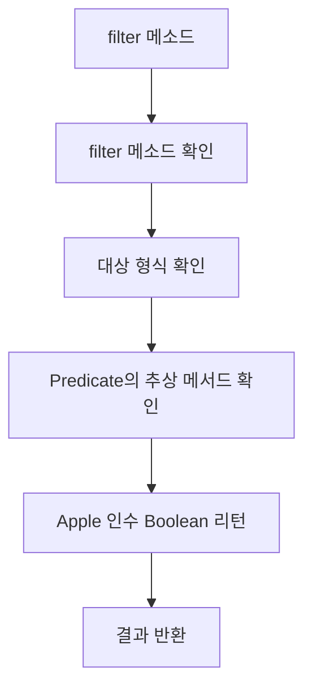

# Chapter 3 람다 표현식   
## 목차
[3.1 람다란 무엇인가?](#31-람다란-무엇인가)  
[3.2 어디에, 어떻게 람다를 사용할까?](#32-어디에-어떻게-람다를-사용할까) 
* [3.2.1 함수형 인터페이스](#321-함수형-인터페이스)

[3.3 람다 활용: 실행 어라운드 패턴](#33-람다-활용-실행-어라운드-패턴)  
[3.4 함수형 인터페이스 사용](#34-함수형-인터페이스-사용)  
[3.5 형식 검사, 형식 추론, 제약](#35-형식-검사-형식-추론-제약)  

[3.6 메서드 참조](#36-메서드-참조)  
* [3.6.1 생성자 참조](#361-생성자-참조)

[3.7 람다 메서드 참조 활용하기](#37-람다-메서드-참조-활용하기)  

[3.8 람다 표현식을 조할 할 수 있는 유용한 메서드](#38-람다-표현식을-조할-할-수-있는-유용한-메서드)

* [3.8.1 comparator 조합](#381-comparator-조합)
* [3.8.2 predicate 조합](#382-predicate-조합)
* [3.8.3 function 조합](#383-function-조합)

***

## 3.1 람다란 무엇인가?
- 람다 표현식은 메서드로 전달할 수 있는 익명 함수를 단순화한 것이라고 할 수 있다. 
- 람다의 특징
    #### 익명 
    - 보통의 메서드와 달리 이름이 없으므로 익명이라 표현한다. 
    #### 함수 
    - 람다는 메서드처럼 특정 클래스에 종속되지 않으므로 함수라고 부른다. 
    - 메서드 처럼 파라미터 리스트, 바디, 반환 형식, 가능한 예외 리스트를 포함한다. 
    #### 전달 
    - 람다 표현식을 메서드 인수로 전달하거나 변수로 저장할 수 있다. 
    #### 간결성 
    ```java
    Comparator<Apple> byWeight = new Comparator<Apple>() {
        public int compare(Apple a1, Apple a2){
            return Integer.compare(a1.getWeight(), a2.getWeight());
        }
    };

    Comparator<Apple> byWeight2  = 
        (a1, a2) -> Integer.compare(a1.getWeight(), a2.getWeight());    
    ```
    - 람다 표현식은 파라미터, 화살표, 바디로 이루어진다. 
    ```java
    (Apple a1, Apple a2) -> a1.getWeight().compareTo(a2.getWeight());
    //<---람다 파라미터--->      <------------- 람다 바디 ------------->
    ```
*** 
## 3.2 어디에, 어떻게 람다를 사용할까?
- 함수형 인터페이스 문맥에서 람다 표현식을 사용할 수 잇다. 
### 3.2.1 함수형 인터페이스 
- 함수형 인터페이스는 오직 하나의 추상 메서드만 지정한다. 
- 많은 디폴트 메서드가 있더라도 추상 메서드가 오직 하나면 함수형 인터페이스다. 
- 람다 표현식으로 함수형 인터페이스의 추상 메서드 구현을 직접 전달할 수 있으므로 전체 표현식을 함수형 인터페이스의 인스턴스로 취급 가능하다. 
### 3.2.2 함수 디스크립터 
- 함수형 인터페이스의 추상 메서드 시그니처는 람다 표현식의 시그니처를 가리킨다. 
- 람다 표현식의 시그니처를 서술하는 메서드를 함수 디스크립터라고 부른다. 
    #### @FunctionalInterface
    - @FunctionalInterface는 함수형 인터페이스임을 가리키는 어노테이션이다. 
    - @FunctionalInterface로 인터페이스를 선언했지만 실제로 함수형 인터페이스가 아니면 컴파일러가 에러를 발생시킨다. 

## 3.3 람다 활용: 실행 어라운드 패턴
- 자원처리에 사용하는 순환 패턴은 자원을 열고, 처리한 다음에 자원을 닫는 순서로 이루어진다. 

***

## 3.4 함수형 인터페이스 사용
- 함수형 인터페이스는 오직 하나의 추상 메서드를 지정한다.  
- 람다 표현식을 사용하려면 공통의 함수 디스크립터를 기술하는 함수형 인터페이스 집합이 필요하다. 
- 자바 8에는 java.util.function 패키지로 여러 가지 새로운 함수형 인터페이스를 제공한다. 
### 3.4.1 Predicate 
- java.util.function.Predicate<T> 인터페이스는 test라는 추상메서드를 정의하고 제레릭 형식의 T 객체를 인수로 받아서 불리언을 반환한다. 
```java

@FunctionalInterface
static interface Predicate<T> {
    boolean test(T t);
    
}

public static <T> List<T> filter(List<T> list, Predicate<T> p){
    List<T> results = new ArrayList<>();
    for (T t : list) {
        if(p.test(t)){
            System.out.println(t);
            results.add(t);
        }
    }
    return results;
}

```
### 3.4.2 Consumer 
- void를 반환하는 accept라는 추상 메서드를 정의한다.
- T 형식의 객체를 인수로 받아서 어떤 동작을 수행하고 싶을 때 Consumer인터페이스를 사용할 수 있다.  

```java
@FunctionalInterface
static interface  Comsumer<T> {
    void accept(T t);
}
public static <T> void  foreach(List<T> list, Consumer<T> c){
    for (T t : list) {
        c.accept(t);
    }
}

```
### 3.4.3 Funcion 
- 제네릭 형식 T를 인수로 받아서 제네릭 형식 R을 반환하는 추상메소드 apply를 정의하다. 
- 입력을 출력으로 매핑하는 람다를 정의할 때 활용할 수 있다. 
```java
@FunctionalInterface 
static interface Function<T, R> {
    R apply(T t);
    
}

public static <T> List<T> filter(List<T> list, Predicate<T> p){
    List<T> results = new ArrayList<>();
    for (T t : list) {
        if(p.test(t)){
            System.out.println(t);
            results.add(t);
        }
    }
    return results;
}

```

#### 기본형 심화 
- 자바의 모든 형식은 참조형과 기본형으로 나뉜다. 
- 제네릭 파마티퍼는 참조형만 가능하다. 
- 자바에서는 기본형을 참조형 변환(박싱), 참조형을 기본형 변환(언박싱), 자동 변환(오토박싱) 기능을 제공한다. 
- 박싱한 값은 기본형을 감싸는 래퍼며 힙에 저장된다. 
- 박싱한 값은 메모리를 더 소비하여 기본형을 가져올 때도 메모리를 탐색하므로 비용이 소모된다. 
- 자바 8에서는 기본형을 입출력으로 사용하는 상황에서 오토방식 동작을 피할수 있도록 특별한 버전의 함수형 인터페이스를 제공한다. 
***
## 3.5 형식 검사, 형식 추론, 제약
- 람다 표현식 자체에는 어떤 함수형 인터페이스를 구현 정보가 표현되어 있지 않기 때문에 람다 표현식을 제대로 이해하려면 실제 형식을 파악해야 한다. 
### 3.5.1 형식 검사
- 람다가 사용되는 콘텍스트를 이용해서 람다의 형식을 추론할 수 있다. 
- 어떤 콘텍스트에서 기대되는 람다 표현식의 형식을 대상 형식이라고 부른다. 
```java

List<Apple> heavierThan150 = filter(invertory, apple -> apple.getWeight() > 150);
@FunctionalInterface
interface Predicate<T> {

    boolean test(T t);
    
}
public <T> List<T> filter(List<T> list, Predicate<T> p){
List<T> results = new ArrayList<>();
for (T t : list) {
    if(p.test(t)){
        System.out.println(t);
        results.add(t);
    }
}
return results;
}
```
- filter 메서드의 선언을 확인한다.
- filter 메서드 두번째 파라미터로 <U>**대상 형식**</U>을 기대한다.
- Predicate<Apple>은 test라는 한개의 추상 메서드를 정의하는 함수형 인터페이스이다. 
- test 메서드는 Apple를 받아 boolean을 반환하는 함수 디스크립터를 묘사한다. 
- filter메서드로 전달받은 인수는 위와 같은 요구사항을 만족해야 한다.


### 3.5.2 같은 람다, 다른 함수형 인터페이스 
- 대상 형식이라는 특징 때문에 람다 표현식은 같더라도 호환되는 추상메서드를 가진 다른 함수형 인터페이스를 사용할 수 있다. 

### 3.5.3 형식 추론 
- 자바 컴파일러는 람다 표현식이 사용된 콘텍스트를 이용해 람다 표현식과 관련된 함수형 인터페이스를 추론한다. 
- 대상 형식을 이용해서 함수 디스크립터를 알 수 있으므로 컴파일러는 람다의 시그니처도 추론할 수 있다. 

### 3.5.4 지역변수 사용 
- 람다 표현식에서는 익명 함수가 하는 것 처럼 자유 변수를 활용 가능하다. 이와 같은 동작을 람다 캡처링이라고 부른다. 
- 람다른 인스턴스 변수와 정적 변수를 자유롭게 캡처할 수 있다. 
- 지역벽수는 명시적으로 final로 선언되거나, 실질적으로 final로 선언된 변수와 똑같이 사용되어야 한다. 

#### 지역 변수 제약 
 
## 3.6 메서드 참조
- 메서드 참조를 이용하면 기존의 메서드 정의를 재활용 해서 람다 처럼 전달 가능하다. 
- 메서드 참조는 특정 메서드만을 호출하는 람다의 축약형이라고 생각할 수 있다.
- 메서드 참조를 이용하면 기존 메서드 구현으로 람다 표현식을 만들 수 있다. 
- 명시적으로 메서드명을 참조함으로써 가독성을 높일 수 있다. 

#### 메서드 참조를 만드는 방법 
- 정적 메서드 참조 
- 다양한 인스턴스 메서드 참조 
- 기존 객체의 인스턴스 메서드 참조 
### 3.6.1 생성자 참조 
- ClassName::new 처럼 클래스명과 new 키워드를 이용해서 기존 생성자의 참조를 만들 수 있다. 

## 3.7 람다 메서드 참조 활용하기
```java
 public static void main(String[] args) {
    List<Apple> inventory = Arrays.asList(
        new Apple(300, Color.GREEN),
        new Apple(40, Color.RED),
        new Apple(180, Color.GREEN),
        new Apple(200, Color.RED));

    // 1단계 
    System.out.println("1단계 코드 전달");
    inventory.sort(new AppleComparator());
    for (Apple apple : inventory) {
        System.out.println(apple);
    }


        // 2단계 
    System.out.println("2단계 익명 클래스 사용");

    inventory.sort(new Comparator<Apple>() {
        public int compare(Apple a1, Apple a2) {
            return Integer.compare(a1.getWeight(), a2.getWeight());
        }
    });

    System.out.println("3단계 람다 사용");
    inventory.sort((a1, a2) -> Integer.compare(a1.getWeight(), a1.getWeight()));
    
    System.out.println("4단계 메서드 참조");
    inventory.sort(Comparator.comparingInt(Apple::getWeight));

}

static public class AppleComparator implements Comparator<Apple>{

    @Override
    public int compare(Apple a1, Apple a2) {
        return Integer.compare(a1.getWeight(), a2.getWeight());
    }
}
```
## 3.8 람다 표현식을 조할 할 수 있는 유용한 메서드
### 3.8.1 Comparator 조합 
- Comparator.comparing을 이용해서 비교에 사용할 키를 추출하는 Function기반의 Comparator를 반환 가능하다. 
- 역정렬을 하기 위해서는 reversed를 사용한다.  
- thenComparing를 이용하면 두번째 비교를 만들 수 있다. 
### 3.8.2 Predicate 조합 
- Predicate 인터페이스는 복잡한 프레디케이를 만들 수 있도록 negate, and, or 세가지 메서드를 제공한다. 
### 3.8.3 Function 조합 
- Funcation 인터페이스는 Function인스턴스를 반환하는 andThen, compose 두 가지 디폴트 메서드를 제공한다. 
- andThen 메서드는 주어진 함수 먼저 적용한 결과를 다른 함수의 입력으로 전달하는 함수를 반환한다. 
- compose 메서드는 인수로 주어진 함수를 먼저 실행한 다음에 그 결과를 외부 함수의 인수로 제공한다. 


***
> 마틴 게이브리얼 우르마, 『모던 자바 인 액션』, 한빛미디어 (2019)  
