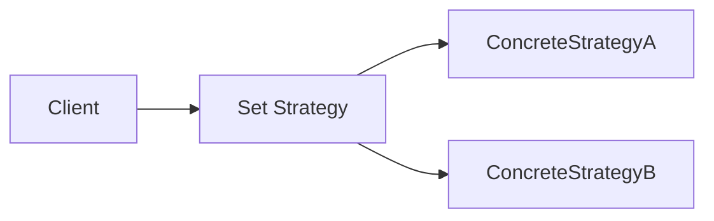

# Chapter 9 리펙터링, 테스팅, 디버깅      
## 목차
[9.1 가독성과 유연성을 개선하는 리팩터링](#91-가독성과-유연성을-개선하는-리팩터링-)  
* [9.1.1 코드 가독성 개선](#911-코드-가독성-개선)
* [9.1.2 익명 클래스를 람다 표현식으로 리팩터링 하기](#912-익명-클래스를-람다-표현식으로-리팩터링-하기)
* [9.1.3 람다표현식을 메서드 참조로 리팩터링 하기](#913-람다표현식을-메서드-참조로-리팩터링-하기)
* [9.1.4 명령형 데이터 처리를 스트림으로 리팩터링하기](#914-명령형-데이터-처리를-스트림으로-리팩터링하기)
* [9.1.5 코드 유연성 개선](#915-코드-유연성-개선)

[9.2 람다로 객체지향 디자인 리팩터링하기](#92-람다로-객체지향-디자인-리팩터링하기)  
* [9.2.1 전략패턴](#921-전략패턴)
* [9.2.2 템플릿 메서드 사용](#922-템플릿-메서드-사용)
* [9.2.3 옵저버](#923-옵저버)
* [9.2.4 옵저버](#924-의무-체인)
* [9.2.5 팩토리](#925-팩토리)

[9.3 람다 테스팅](#93-람다-테스팅)  
* [9.3.1 보이는 람다 표현식의 동작 테스팅](#931-보이는-람다-표현식의-동작-테스팅)  
* [9.3.4 람다를 사용하는 메서드의 동작에 집중하라](#932-람다를-사용하는-메서드의-동작에-집중하라) 
* [9.3.4 고차원 함수테스팅](#934-고차원-함수-테스팅) 
[9.4 디버깅](#94-디버깅)  
* [9.4.1 스택 트레이스 확인](#941-스택-트레이스-확인)  
* [9.4.2 정보 로깅](#942-정보-로깅)
*** 
## 9.1 가독성과 유연성을 개선하는 리팩터링 
### 9.1.1 코드 가독성 개선
- 코드의 가독성이 좋다는 것은 어떤 코드를 다른 사람도 쉽게 이해할 수 있음을 의미한다.  
### 9.1.2 익명 클래스를 람다 표현식으로 리팩터링 하기
- 하나의 추상 메서드를 구현하는 익명 클래스를 람다표현식으로 리팩터링 가능하다. 
- 모든 익명 클래스를 람다표현식으로 변환할 수 있는 것은 아니다. 
- 익명 클래스에서 this는 익명 클래스 자신을 가리키지만 람다에서는 this는 람다를 감싸는 클래스를 의미한다. 
- 익명 클래스는 감싸고 있는 클래스의 변수를 가릴 수 있지만 람다 표현식으로는 가릴 수 없다. 
- 익명 클래스는 람다표현식으로 바꾸면 콘텍스트 오버로딩에 따른 모호함이 초래될 수 있다. 
- 
### 9.1.3 람다표현식을 메서드 참조로 리팩터링 하기
- 람다 표현식은 대신 메서드 참조를 이용하면 가독성을 높일 수 있다. 
```java
menu.stream()
        .collect(
        groupingBy(Dish::getType,
        groupingBy(dish -> {
        if (dish.getCalories() <= 400)
            return CaloricLevel.DIET;
        else if (dish.getCalories() <= 700)
            return CaloricLevel.NORMAL;
        else
            return CaloricLevel.FAT;
        })));


Map<CaloricLevel, List<Dish>> dishesByCaloricLevel = menu.stream()
        .collect(groupingBy(Dish::getCaloricLevel))
```
### 9.1.4 명령형 데이터 처리를 스트림으로 리팩터링하기
- 스트림 API는 데이터 처리 파이프라인의 의도를 더욱 명확하게 보여준다. 
```java
List<String> dishNames = new ArrayList<>(); 
for(Dish dish: menu){
    if(dish.getCalories()>300){
        dishNames.add(dish.getName());
    }
}


menu.parallelStream()
        .filter(d -> d.getCalories() > 300)
        .map(Dish::getName)
        .collect(toList());

```
### 9.1.5 코드 유연성 개선
- 다양한 람다를 전달해서 다양한 동작 표현이 가능하다. 
#### 조건부 연기 실행 
#### 실행 어라운드 패턴 
- 매번 같은 준비 종료 과정을 반복적으로 수행 하는코드가 있다면 람다로변환할수있다.
- 준비,종료 과정을 처리하는 로직을 재사용함으로써 코드 중복을 줄일수있다.

***

## 9.2 람다로 객체지향 디자인 리팩터링하기
- 다양한 패턴을 유형별로 정리한 것이 디자인 패턴이다. 
- 디자인 패턴은 공통적인 소프트웨어 문제를 설계할 때 재사용할 수 있는, 검증된 청사진을 제공한다. 
### 9.2.1 전략패턴 
- 알고리즘을 보유한 상태에서 런타임에게 적절한 알고리즘을 선택하는 기법이다. 
- 다양한 기준을 갖는 입력값 검증, 다양한 파싱 방법 사용, 입력 형식 설정 등 다양하 시나리오에 전략 패턴을 활용 가능하다. 


```java
Validator numericValidator = new Validator(new IsNumric());
boolean b1 = numericValidator.validate("aaaa");
Validator lowerCaseValidator = new Validator(new IsAllLowerCase());
boolean b2 = lowerCaseValidator.validate("bbbb");
Validator numericLambda = new Validator((s) -> s.matches("[a-z]+"));
Validator lowerCaseLambda = new Validator((s) -> s.matches("\\d+"));
boolean b3 = numericLambda.validate("aaaa");
boolean b4 = lowerCaseLambda.validate("bbbb");
```
### 9.2.2 템플릿 메서드 사용 
- 알고리즘의 개요를 제시한 다음에 알고리즘의 일부를 고칠 수 있는 유연함을 제공해야 할 때 템플릿 메서드 디자인 패턴을 사용한다.

### 9.2.3 옵저버 
- 어떤 이벤트가 발생했을 때 한 객체가 다른 객체 리스트에 자동으로 알림을 보내야 하는 상황에서 옵저버 디자인 패턴을 사용한다. 

### 9.2.4 의무 체인 
- 작업 처리 객체의 체인을 만들 때는 의무 체인 패턴을 사용한다. 
- 한 객체가 어떤 작업을 처리한 다음에 다른 객체로 결과를 전달하고 다른 객체도 해야 할 작업을 처리한 다음에 다음에 또 다른 객체로 전달 하는 방식이다. 

### 9.2.5  팩토리 
- 인스턴스화 로직을 클라이언트에 노출하지 않고 객체를 만들 때 팩토리 디자인 패턴을 사용한다.
```java
Product p = ProductFactory.createProduct("loan");
        Supplier<Product> loanSupplier = Loan::new;
```

***

## 9.3 람다 테스팅
### 9.3.1 보이는 람다 표현식의 동작 테스팅 
- 람다를 필드에 저장해서 재사용할 수 있으며 람다의 로직을 테스트 할 수 있다. 

```java
public class Point {
public final static Comparator<Point> compareByXAndThenY =
           comparing(Point::getX).thenComparing(Point::getY);
       ...
}


@Test
public void testComparingTwoPoints() throws Exception {
    Point p1 = new Point(10, 15);
    Point p2 = new Point(10, 20);
    int result = Point.compareByXAndThenY.compare(p1 , p2); assertTrue(result < 0);
}
```
### 9.3.2 람다를 사용하는 메서드의 동작에 집중하라 
- 람다의 목표는 정해진 동작을 다른 메서드에 사용할 수 있도록 하나의 조각으로 캡슐화하는 것이다. 
- 세부 구현을 포함하는 람다 표현식을 공개하지 말아야 한다. 
- 람다 표현식을 사용하는 메서드의 동작을 테스트함으로써 람다 표혁식을 검증 가능하다. 
```java
public static List<Point> moveAllPointsRightBy(List<Point> points, int x) { return points.stream()
                    .map(p -> new Point(p.getX() + x, p.getY()))
                    .collect(toList());
}

@Test
public void testMoveAllPointsRightBy() throws Exception {
        List<Point> points =
        Arrays.asList(new Point(5, 5), new Point(10, 5));
        List<Point> expectedPoints =
        Arrays.asList(new Point(15, 5), new Point(20, 5));
        List<Point> newPoints = Point.moveAllPointsRightBy(points, 10);
        assertEquals(expectedPoints, newPoints);
        }
```
### 9.3.4 고차원 함수 테스팅
- 메서드가 람다를 인수로 받는다면 다른 람드로 메서드의 동작을 테스트할 수 있다. 
```java
@Test
public void testFilter() throws Exception {
List<Integer> numbers = Arrays.asList(1, 2, 3, 4); 
List<Integer> even = filter(numbers, i -> i % 2 == 0); 
List<Integer> smallerThanThree = filter(numbers, i -> i < 3); 
assertEquals(Arrays.asList(2, 4), even); 
assertEquals(Arrays.asList(1, 2), smallerThanThree);
}
```
***

## 9.4 디버깅
- 문제가 발생한 코드를 디버깅 할 때 개발자는 스택 트페이스, 로깅을 확인해야 한다. 
- 람다 표현식과 스트림은 디버깅 기법을 무력화 한다. 
### 9.4.1 스택 트레이스 확인 
- 프로그램의 실행이 중단 되었다면 스택 프레임에서 정보를 얻을 수 있다. 
- 프로그램이 메서드를 호출할 때 마다 프로그램에서의 호출 위치 , 호출 시 인수값, 호출된 메서드, 지역 변수 등을 포함한 호출 정보가 생성되고 이들 정보는 스택 프레임에 저장된다. 
- 프로그램이 멈췄다면 프로그램이 어떻게 멈추게 되었는지 프레임별로 보여 주는 스택 트레이스를 얻을 수 있다. 

#### 람다와 스택트레이스 
- 람다 표현식과 관련한 스택 트레이스는 이해하기 어려울 수 있다.

### 9.4.2 정보 로깅 
- 스트림의 파이프라인 연산을 디버깅 할때 forEach를 호출하는 순간 전체 스트림이 소비된다. 
- 스트림의 각각의 연산이 어떤 결과를 도출하는지 확인하기 위해서는 peek라는 스트림 연산을 활용 가능하다. 
- 

***
> 마틴 게이브리얼 우르마, 『모던 자바 인 액션』, 한빛미디어 (2019)  

