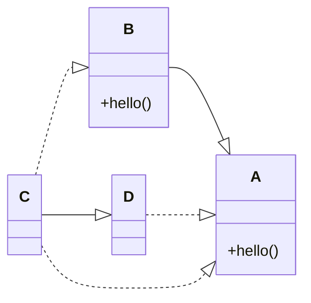
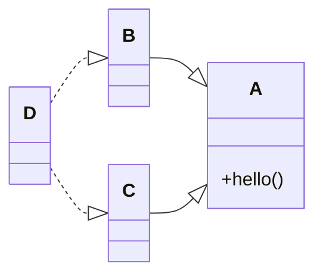

# Chapter 13 디폴트 메서드 
## [목차]

[13 들어가며](#13-들어가며)

[13.1 변화하는 API](#131-변화하는-api)
* [13.1.1 API 버전 1](#1311-api-버전-1)
* [13.1.2 API 버전 2](#1312-api-버전-2)

[13.2 디폴트 메서드란 무엇인가?](#132-디폴트-메서드란-무엇인가)  
[13.3 디폴트 메서드 활용 패턴](#133-디폴트-메서드-활용-패턴)

* [13.3.1 선택형 메서드](#1331-선택형-메서드)  
* [13.3.2 동작 다중 상속 ](#1332-동작-다중-상속)  

[13.4 해석 규칙 ](#134-해석-규칙)
* [13.4.1 알아야 할 세가지 해결 규칙](#1341-알아야-할-세가지-해결-규칙)
* [13.4.2 디폴트 메서드를 제공하는 서브인터페이스가 이긴다](#1342-디폴트-메서드를-제공하는-서브인터페이스가-이긴다)
* [13.4.3 충돌 그리고 명시적인 문제 해결](#1343-충돌-그리고-명시적인-문제-해결)
* [13.4.4 다이아몬즈 문제]() 

## 13 들어가며 
- 인터페이스를 구현하는 클래스는 인터페이스에서 정의하는 모든 메서드 구현을 제공 하거나 아니면 슈퍼클래스의 구현을 상속 받아야 한다. 
- 인터페이스에 새로운 메서드를 추가하는 등 인터페이스를 바꾸면 해당 인터페이스의 모든 클래스의 구현도 고쳐야 한다. 
- 자바 8에서는 정적 메서드와 디폴트 메서드를 통해 이러한 문제를 해결 할 수 있다. 

## 13.1 변화하는 API
### 13.1.1 API 버전 1
### 13.1.2 API 버전 2
***
## 13.2 디폴트 메서드란 무엇인가?
- 자바 8에서는 호환성을 유지하면서 API를 바꿀 수 있도록 새로운 기능인 디폴트 메서드를 제공한다. 
- 인터페이스는 자신을 구현하는 클래스에서 메서드를 구현하지 않을 수 있는 메서드 시그니처를 제공한다. 
- 디폴트 메서드는 default라는 키워드로 시작하며 메서드 바디를 포함한다. 
```java
public interface Sized{
    int size();
    default boolean isEmpty(){
        return size() == 0;
    }
}
```
#### 추상 클래스와 자바 8의 인터페이스 
- 클래스는 하나의 추상 클래스만 상속 가능하지만 인터페이스는 여러 개 구현이가능하다. 
- 추상 클래스는 인스턴스 변수를 공통 상태로 가질 수 있지만 인터페이스는 인스턴스 변수를 가질 수 없다.
***
## 13.3 디폴트 메서드 활용 패턴
### 13.3.1 선택형 메서드
### 13.3.2 동작 다중 상속
- 디폴트 메서드를 이용하면 기존에는 불가능 했던 동작 다중 상속 기능도 구현이 가능하다.

```java
public class ArrayList<E> extends AbstractList<E>
        implements List<E>, RandomAccess, Cloneable, Serializable {
    
}
```

#### 다중 상속 형식 
- ArrayList는 한 개의 클래스를 상속 받고 여섯 개의 인터페이스를 구현한다. 

#### 기능이 중복되지 않는 최소의 인터페이스 
```java

``` 

***
## 13.4 해석 규칙
- 자바 8에는 디폴트 메서드가 추가 되었으므로 같은 시그니처를 갖는 디폴트 메서드를 상속받는 상황이 발생 가능하다. 
```java
interface A{
    default void hello() {
        System.out.println("Hello from A");
    }
}

interface B extends A{
    default void hello() {
        System.out.println("Hello from B");
    }
}

class C implements B, A {
    public static void main(String[] args) {
        new C().hello();
    }
}

```
### 13.4.1 알아야 할 세가지 해결 규칙
- 클래스가 항상 이긴다. 클래스나 슈퍼 클래스에서 정의한 메서드가 디폴트 메서드보다 우선권을 갖는다. 
- 위 규칙 이외의 상황에서는 서브 인터페이스가 이긴다. 상속 관계를 갖는 인터페이스에서 같은 시그니처를 갖는 메서드를 정의할 때는 서브 인터페이스가 이긴다. 
- 여전히 디폴트 메서드의 우선 순위가 결정 되지 않았다면 여러 인터페이스를 상속 받는 클래스가 명시적으로 디폴트 메서드를 오버라이드 하고 호출해야 한다. 
### 13.4.2 디폴트 메서드를 제공하는 서브인터페이스가 이긴다


### 13.4.3 충돌 그리고 명시적인 문제 해결
```java
static interface A{
    default void hello() {
        System.out.println("Hello from A");
    }
}

static interface B {
    default void hello() {
        System.out.println("Hello from B");
    }
}
static class C implements B, A {
    @Override
    public void hello() {
        B.super.hello();
    }

}

```
- 인터페이스 간에 상속 관계가 없으므로 두 번째 규칙을 적용할 수 없다. 
- 자바 컴파일러는 Error class C inherits unrelated defaults for hello() from types B and A 같은 에러가 발생한다. 
- 충돌을 해결하기 위해서는 클래스 C에서 메서드를 오버라이드 한 다음에 호출하려는 메서드를 명시적으로 선택헤야 한다.  
### 13.4.4 다이아몬드 문제
```java
public static void main(String[] args) {
    new D().hello();
}
static interface A {
    default void hello(){
        System.out.println("Hello from A");

    }
}
static interface B extends A{ }
static interface C extends A{ }

static class D implements B, C {
    public static void main(String[] args) {

    }
}
```

- 다이어그램의 모양이 다이아몬드를 닮았으므로 다이아몬드 문제라고 부른다. 
- D의 출력 결과는 Hello from A가 된다. 
- B에도 같은 시그니처의 디폴트 메서드가 있다면 디폴트 메서드를 제공하는 가장 하위의 인터페이스가 선택된다. 
- B, C 모두 디폴트 메서드를 정의하면 충돌이 발생하므로 이전에 설명한 것 처럼 하나의 메서드를 명시적으로 호출해야 한다. 
***
> 마틴 게이브리얼 우르마, 『모던 자바 인 액션』, 한빛미디어 (2019)  

