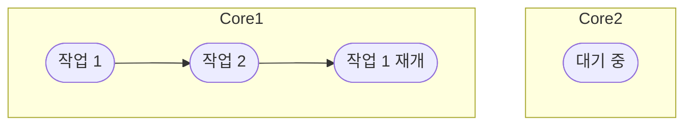
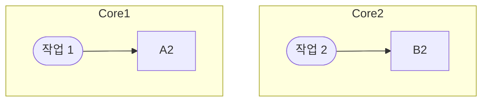
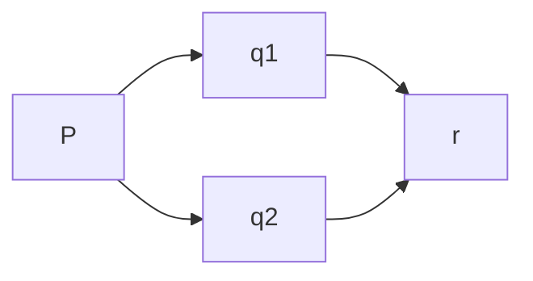

# Chapter 15 CompletableFuture와 리액티브 프로그래밍 기초 
## [목차]
[15 들어가며](#15-들어가며)

[15.1 동시성을 구현하는 자바 지원의 진화](#151-동시성을-구현하는-자바-지원의-진화)
* [15.1.1 스레드와 높은 수준의 추상화](#1511-스레드와-높은-수준의-추상화)
* [15.1.2 Executor와 스레드 풀](#1512-executor와-스레드-풀)
* [15.1.3 스레드와 다른 추상화 : 중첩되지 않은 메서드 호출](#1513-스레드와-다른-추상화--중첩되지-않은-메서드-호출)
* [15.1.4 스레드에 무엇을 바라는가](#1514-스레드에-무엇을-바라는가)

[15.2 동기 API 와 비동기 API](#152-동기-api-와-비동기-api)
* [15.2.1 Future 형식 API](#1521-future-형식-api)
* [15.2.2 리액티브 형식 API](#1522-리액티브-형식-api)
* [15.2.3 잠자기(그리고 기타 블로킹 동작)는 해로운 것으로 간주](#1523-잠자기그리고-기타-블로킹-동작는-해로운-것으로-간주)
* [15.2.4 현실성 확인](#1524-현실성-확인)
* [15.2.5 비동기 API는 예외를 어떻게 처리하는가?](#1525-비동기-api에서-예외는-어떻게-처리-하는가)
[15.3 박스와 채널 모델](#153-박스와-채널-모델)

[15.4 CompletableFuture와 콤비네이션을 이용한 동시성](#154-completablefuture와-콤비네이션을-이용한-동시성)

[15.5 발행-구독 그리고 리액티브 프로그래밍](#155-발행-구독-그리고-리액티브-프로그래밍)
* [15.5.1 두 플로를 합치는 예제](#1551-두-플로를-합치는-예제)
* [15.5.2 역 입력](#1552-역압력)
* [15.5.3 실제 역압력의 간단한 형태](#1553-실제-역압력의-간단한-형태)

[15.6 리액티브 시스템 vs 리액티브 프로그래밍](#156-리액티브-시스템-vs-리액티브-프로그래밍)

## 15 들어가며
- 소프트웨어 개발 방법의 두가지 추세중 하나는 애플리케이션을 실행하는 하드웨어와 관련한 것이고 다른 하나는 애플리케이션을 어떻게 구성하는가와 관련된 것이다. 
- 멀티 코어 프로세서가 발전하면서 애플리케이션은 멀티 코어 프로세서를 얼마나 잘 활용할 수 있도록 소프트웨어를 개발하는가에 따라 달라질 수 있다. 
- 마이크로서비스 아키텍처 선택이 증가했고 작아진 대신 네트워크 통신이 증가한다. 
- 포크 조인 프레임워크와 병렬 스트림은 병렬성의 귀중한 도구이고 동시성을 필요로 하는 상황에서는 스레드를 블록하는 등의 연산 자원을 낭비하는 일을 피해야 한다.


## 15.1 동시성을 구현하는 자바 지원의 진화
- 처음 자바는 Runnable, Thread, Synchronized 키워드를 이용한 클래스와 메서드를 통한 잠금을 이용했다. 
- 자바 5에서 동시성을 지원하는 스레드 실행과 태스크 제출을 분리하는 ExecutorService 인터페이스, Runnable, Thread의 변형을 반환하는 Callable<T>, Future<T> 제네릭등을 지원했다. 
- 자바 7에서는 포크 조인 구현을 지원하는 java.util.concurrent.RecursiveTask가 추가 되었다. 
- 자바 8에서는 스트림과 람다 지원에 기반한 병렬 프로세싱이 추가 되었다. 
- 자바 9에서는 분산 비동기 프로그래밍을 명시적으로 지원, 발행-구독 프로토콜(java.util.concurrent.Flow 인터페이스 추가) 
### 15.1.1 스레드와 높은 수준의 추상화
- 병렬 스트림 반복은 명시적으로 스레드를 사용하는 것에 비해 높은 수준의 개념이다. 
- 스트림을 사용해서 스레드 사용패턴을 추상화 할 수 있다. 
### 15.1.2 Executor와 스레드 풀
#### 스레드의 문제 
- 자바 스레드는 직접 운영체제 스레드에 접근 한다. 운영체제 생성, 종료는 비싼 비용을 치러야 하며 운영 체제의 스레드 숫자는 제한 되어 있다. 
- 주어진 프로그램에서 사용할 최적의 자바 스레드 개수는 사용할 수 있는 하드웨어 코어의 개수에 따라 달라진다.
#### 스레드 풀 그리고 스레드 풀이 더 좋은 이유 
- 자바는 ExecutorService는 태스크를 제출하고 나중에 결과를 수집할 수 있는 인터페이스를 제공한다. 
- newFixedThreadPool 같은 팩토리 메서드를 중 하나를 이용해 스레드 풀을 만들어서 사용가능하다.

```java
ExecutorService newFixedThreadPool(int nThreads);
```
- 태스크 실행이 종료되면 스레드풀로 반환한다. 하드웨어에 맞는 수의 태스트크 유지함과 동시에에 수 천개의 태스크를 스레드 풀에 아무 오버헤드 없이 제출할 수 있다. 
#### 스레드풀 그리고 스레드 풀이 나쁜 이유 
- 두 가지 사항을 주의해야 한다. 
- k 스레드를 가진 스레드 풀은 오직 k 만큼의 스레드를 동시에 실행할 수 있다. 
- 초과로 제출된 태스크는 큐에 저장되며 이전 태스크 중 하나가 종료될 때 까지 스레드에 할당하지 않는다. 
- 잠을 자거나 I/O, 네트워크 연결이 있는 태스크가 있다면 주의해야 한다. I/O를 기다리는 블록상황에서 이들 태스크가 워커 스레드에 할당된 상태를 유지하지만 아무 작업도 하지 않게 된다. 
- 중요 코드를 실행하는 스레드가 죽는 일이 발생하지 않도록 main이 반환되기 전에 모든 스레드의 작업이 끝나길 기다린다. 
- 프로그램을 종료하기 전에 모든 스레드 풀을 종료하는 습관을 갖는 것이 중요하다. 
### 15.1.3 스레드와 다른 추상화 : 중첩되지 않은 메서드 호출
- 동시성에서는 한 개의 특별한 속성(태스크, 스레드)가 메서드 호출 안에서 시작되면 그 메서드는 호출은 반환하지 않고 작업이 끝나기를 기다렸다.
- 스레드 생성과 join이 한쌍 처럼 중첩된 메서드 호출내에 추가 되는 것을 엄격한 포크/조인이라고 부른다. 
- 메서드 호출에 의해 스레드 생성되고 메서드를 벗어나 계속 실행되는 동시성 형태에 초점을 두는 이런 종류의 메서드는 비동기 메서드라고 한다. 
- 비동시 메서드는 데이터 경쟁 문제와 스레드의 종료에 관련하여 위험성이 따른다. 
### 15.1.4 스레드에 무엇을 바라는가
- 하드웨어 스레드를 활용해서 병렬성의 장점을 극대화 하도록 프로개램의 구조를 만드는 것 프로그램을 태스크 단위로 구조화하는 것이 목표다. 
***
## 15.2 동기 API 와 비동기 API
- 외부 반복(명시적 for루프)와 내부 반복(스트림 메서드)를 사용해서 병렬성을 이용할 수 있다.
- 아래와 같은 시그니처를 갖는 두 메서드의 호출을 합할 때 별도의 스레드로 이를 실행해서 이를 구현할 수 있다. 
```java
int x = 1337;
Result result = new Result();
Thread t1 = new Thread(() -> { result.left = f(x); } );
Thread t2 = new Thread(() -> { result.right = g(x); });
t1.start();
t2.start();
t1.join();
t2.join();
System.out.println(result.left + result.right);
```
- Runnable 대신에 Future API 인터페이스를 이용해 단순화 할 수 있다. 
```java
ExecutorService es = Executors.newFixedThreadPool(2);
int x = 1337;

Future<Integer> y = es.submit(() -> f(x));
Future<Integer> z = es.submit(() -> g(x));

System.out.println(y.get() + z.get());

es.shutdown();
```
### 15.2.1 Future 형식 API
- 대안을 사용하면 f, g의 시그니처가 다음처럼 바뀐다. 
```java
Future<Integer> f(int x); 
Future<Integer> f(int x);
```
### 15.2.2 리액티브 형식 API
- f, g의 시그니처를 바꿔서 콜백 형식의 프로그래밍을 이용하는 것이다.
```java
void f(int x, IntConsumer dealWithResult);
```
- f에 추가 인수로 콜백을 전달해서 f의 바디에서는 return 문으로 결과를 반환하는 것이 아니라 결과가 준비되면 이를 람다로 호출하는 태스크를 만드는 것이다. 
```java
public static void main(String[] args) {
    int x = 1337;
    Result result = new Result();

    f(x, (int y) -> {
        result.left = y;
        System.out.println(result.left + result.right);
    });

    System.out.println(result.left + result.right);

    g(x, (int z) -> {
        result.right = z;
        System.out.println(result.left + result.right);
    });

    System.out.println(result.left + result.right);
}
```
- 위 코드의 문제점을 if-then-else를 이용해 적절한 락을 이용해 두 콜백이 모두 호출되었는지 확인 후 출력하는 기능을 수행 할 수 있다. 
- 리액티브 형식의 비동기 API는 일련의 값을 Future형식의 API는 일회성 값을 처리하는데 적합하다. 
### 15.2.3 잠자기(그리고 기타 블로킹 동작)는 해로운 것으로 간주
- 어떤 일이 일정 속도로 제한되어 일어나는 상황의 애플리케이션을 만들때 자연스럽게 sleep를 사용 할 수 있다. 
- 스레드는 잠들어도 <u>여전히 시스템 자원을 점유한다.</u>
- 스레드가 많아지고 대부분이 잠을 잔다면 문제가 심각해 진다.  
- 스레드 풀에서는 잠자는 스레드만 실행을 막는 것이 아니라  다른 태스크가 어떤 동작을 완료하기를 기다리는 동작 또한 마찬가지다. 
- 태스크에서는 기다리는 일을 만들지 말거나, 코드에서 예외를 일으키는 방법으로 이를 처리할 수 있다.
```java
long startTime1 = System.currentTimeMillis();
work1();
Thread.sleep(10000);
work2();
long endTime1 = System.currentTimeMillis();
System.out.println("시간: (" + (endTime1 - startTime1) + "ms)");


long startTime2 = System.currentTimeMillis();
ScheduledExecutorService es = Executors.newScheduledThreadPool(1);
work1();
es.schedule(SleepMainV2::work2, 10, TimeUnit.SECONDS);
es.shutdown();
long endTime2 = System.currentTimeMillis();
System.out.println("시간: (" + (endTime2 - startTime2) + "ms)");
```
### 15.2.4 현실성 확인
- 새로운 시스템을 설계할 때 시스템은 동시에 실행되는 많고 작은  태스크로 설계해서 블록할 수 있는 모든 동작을 비동기로 구현한다면 병렬 하드웨어를 최대한 활용가능하지만 현실적으로는 불가능하다. 

### 15.2.5 비동기 API에서 예외는 어떻게 처리 하는가?
- Future나 리액티브 비동기 API에서 호출된 메서드의 실제 바디는 별도의 스레드에서 호출되며 이때 발생하는 에러는 이미 호출자의 실행범위와 관계가 없는 상황이 된다. 
- Future를 구현한 CompletableFuture에서는 런타임 get()메서드에 예외 처리 기능 및 회복할 수 있도록 exceptionally()같은 메서드도 제공한다. 
- 리액티브 형식의 비동기 API에서는 return 대신에 기존 콜백이 호출되므로 예외 발생시의 실행될 추가 콜백을 만들어서 인터페이스를 변경해야 한다. 
```java
void f(int x, Consumer<Integer> dealWithResult, Consumer<Throwable> dealWithException);
```
- 콜백이 여러 개면 이를 따로 제공하는 것보다 한 객체로 이 메서드를 감싸는 것이 좋다. 
- 값이 있을 때,에러가 발생했을때 , 처리할 데이터가 없을 때 각각의 콜백이 호출되는데 이런 종류의 호출을 메시지 또는 이벤트라고 부른다. 
***
## 15.3 박스와 채널 모델
- 동시성 모델을 가장 잘 설계하고 개념화 할려면 그림이 필요한데 이 기법을 박스와 채널 모델이라고 부른다. 

```java
int t = p(x);
System.out.println(r(q1(t), q2(t)));

int t = p(x);
Future<Integer> a1 = executorService.submit(() -> q1(t)); 
Future<Integer> a2 = executorService.submit(() -> q2(t)); 
System.out.println( r(a1.get(),a2.get()));

```
***
## 15.4 CompletableFuture와 콤비네이션을 이용한 동시성
- 동시 코딩 작업을 Future 인터페이스로 생각하도록 유도한다는 점이 Future 인터페이스의 문제다. 
- Future는 실행해서 get()으로 결과를 얻을 수 있는 Callable로 만 들어진다. 
- CompletableFuture는 실행할 코드 없이 Future를 만들 수 있도록 허용하며 complete() 메서드를 이용해 나중에 어떤 값을 이용해 다른 스레드가 이를 완료할 수 있고 get()으로 값을 얻을 수 있도록 허용한다
- CompletableFuture와 콤비네이터를 이용해 get()에서 블록 하지 않고 병렬 실행의 효율성과 데드락을 피하는 최상의 해결책을 구현 가능하다. 
***
## 15.5 발행-구독 그리고 리액티브 프로그래밍
- Future와 CompletableFuture은 <u>독립적 실행과 병렬성이라는 정신적 모델</u>에 기반한다.
- Future는 연산이 끝나면 한번만 실행해서 결과를 제공한다. 
- 리액티브 프로그래밍은 시간이 흐르면서 Future 같은 객체를 통해 여러 결과를 제공한다. 
- 자바 9에서는 java.util.concurrnt.Flow의 인터페이스에 발행-구독 모델을 적용해서 리액티브 프로그래밍을 제공한다. 
- 
### 15.5.1 두 플로를 합치는 예제
- 데이터가 발행자에서 구독자로 흐름에 착안해 개발자는 이를 업스트림 , 다운 스트림이라고 부른다. 
- onNext, onError, onComplete 같은 메서드를 통해서 데이터 흐름에서 예외 발생하거나 흐름 종료를 알 수 있어야 한다. 
- 플로 인터페이스의 개념을 복합하게 만든 두가지 기능은 압력과 역압력이다. 
- 수천 개의 메시지가 onNext로 전달되는 상황을 압력이라고 한다. 
- 자바 9 플로 API에서는 발행자가 문한의 속도로 아이템을 방출하는 대신에 요청했을 때만 다음 아이템을 보내도록 하는 request를 제공한다. 
### 15.5.2 역압력 
- 객체는 Publisher에서 Subscriber로 정보를 전달한다. 
- 정보의 흐름 속도를 역압력(흐름 제어)으로 제어 즉 Subscriber에서 Publisher로 정보를 요청해야 할 필요가 있을 수 있다. 
- Publisher는 여러 Subscriber를 갖고 있으므로 역압력 요청이 한 연결에만 영향을 미쳐야 한다는 것이 문제가 될 수 있다. 
- 자바 9 플로 API의 Subscriber 인터페이스는 네 번째 메서드를 포함한다
### 15.5.3 실제 역압력의 간단한 형태

***
## 15.6 리액티브 시스템 vs 리액티브 프로그래밍
- 리액티브 시스템은 런타임 환경이 변화에 대응하도록 전체 아키텍처가 설계된 프로그램을 가리킨다(반응성, 회복성, 탄력성)
- 여러가지 방법으로 이러한 속성을 구현할 수 있지만 java.util.concurrent.Flow 관련 자바 인터페이스에서 제공하는 리액티브 프로그래밍 형식을 이용하는 것도 주요 방법이다.  
***
> 마틴 게이브리얼 우르마, 『모던 자바 인 액션』, 한빛미디어 (2019)  

