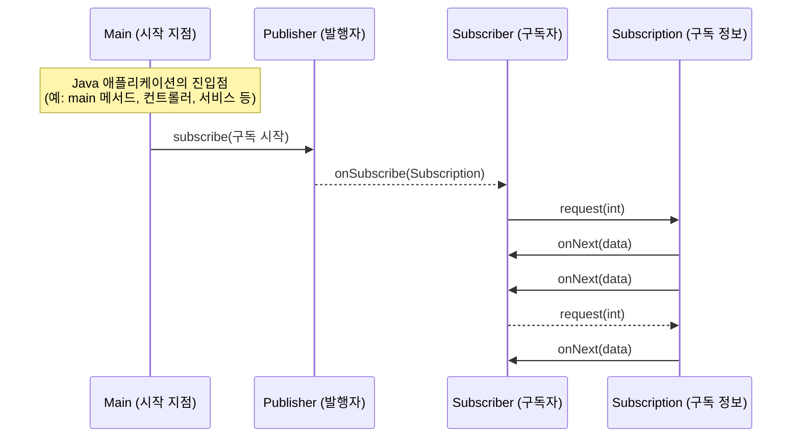

# Chapter 17 리액티브 프로그래밍 
## [목차]
[17.1 리액티브 메니패스토](#171-리액티브-메니패스토)  
* [17.1.1 애플리케이션 수준의 리액티브](#1711-애플리케이션-수준의-리액티브)
* [17.1.2 시스템 수준의 리액티브](#1712-시스템-수준의-리액티브)

[17.2 리액티브 스트림과 플로 API](#172-리액티브-스트림과-플로-api)
* [17.2.1 Flow 클래스 소개](#1721-flow-클래스-소개)
* [17.2.2 첫번째 리액티브 애플리케이션 만들기](#1722-첫번째-리액티브-애플리케이션-만들기)
* [17.2.3 Processor로 데이터 변환하기](#1723-processor로-데이터-변환하기)
* [17.2.4 자바는 왜 플로 API 구현을 제공하지 않는가?](#1724-자바는-왜-플로-api-구현을-제공하지-않는가)

[17.3 리액티브 라이브러이 RxJava 사용하기](#173-리액티브-라이브러이-rxjava-사용하기)
* [17.3.1 Observable 만들고 사용하기](#1731-observable-만들고-사용하기)
* [17.3.2 Observable를 변환하고 사용하기](#1732-observable를-변환하고-사용하기-)

## 17.1 리액티브 메니패스토
#### 리액티브 매니패스토의 핵심 원칙
- 반응성 : 빠를 뿐만 아니라 일정하고 예상할 수 있는 반응 시간을 제공함에 따라 사용자가 기대치를 가질 수 있다. 
- 회복성 : 장애가 발생해도 시스템은 반응해야 한다. 
- 탄력성 : 애플리케이션의 생명 주기 동안 다양한 작업 부하를 받는데 작업 부하가 발생하면 자동으로 할당 자원수를 늘린다. 
- 메시지주도 : 비동기 메시지를 전달해서 컴포넌트 끼리의 통신이 이루어진다. 

### 17.1.1 애플리케이션 수준의 리액티브
- 애플리케이션 수준 컴포넌트의 리액티브 프로그래밍의 주요 기능은 비동기로 작업을 수행 할 수 있다는 점이다.
- 스트림을 블록하지 않고 비동기로 처리하는 것이 최신 멀티코어 CPU의 사용률을 극대화 할 수 있도록 리액티브 프레임워 크와 라이브러리는 스레드를 퓨처, 액터, 일련의 콜백을 발생시키는 이벤트 루프 등과 공유하고 처리할 이벤트를 변환하고 관리한다. 
- 위 기술들은 스레드보다 가볍고, 동시/비동기 애플리케이션 구현의 추상 수준을 높일 수 있으며 블록, 경쟁 조건, 데드닥 같이 저수준의 멀티 스레드 문제를 직접 처리할 필요가 없다. 
### 17.1.2 시스템 수준의 리액티브
- 리액티브 시스템은 여러 애플리케이션이 한 개의 일관적인, 회복할 수 있는 플랫폼을 구성할 수 있게 해주며 애플리케이션 중 하나가 실패해도 전체 시스템은 계속 운영될 수 있도록 도와주는 소프트웨어 아키텍처다.
- 리액티브 시스템의 주요 속성으로 메시지 주도를 꼽을 수 있는데시지는 정의된 목적지 하나를 향하는 반면, 이벤트는 관련 이벤트를 관찰하도록 등록한 컴포 넌트가 수신한다는 점이 다르다. 리액티브 시스템에서는 수신자와 발신자가 각각 수신 메시지, 발신 메시지와 결합하지 않도록 이들 메시지를 비동기로 처리해야 한다.
- 컴포넌트를 완전히 고립하려면 이들이 결합되지 않도록 해야 하고 그 결과로 시스템이 장애(회복성)와 높은 부하 (탄력성)에서도 반응성을 유지할 수 있다.
#### 장애 고립 
- 고립과 비결합이 회복성의 핵심이다!
- 리액티브 아키텍처에서는 컴포넌트에서 발생한 장애를 고립시킴으로 문제가 주변의 다른 컴포넌트로 전파되면서 전체 시스템 장애로 이어지는 것을 막음으로 회복성을 제공한다.

#### 위치 투명성 
- 위치투명성은 탄력성의 핵심이다! 
- 위치 투명성은 리액티브 시스템의 모든 컴포넌트가 수신자의 위치에 상관없이 다른 모든 서비스와 통신할 수 있음 을 의미한다. 
- 위치 투명성 덕분에 시스템을 복제할 수 있으며 현재 작업 부하에 따라 (자동으 로) 애플리케이션을 확장할 수 있다.
## 17.2 리액티브 스트림과 플로 API
- 리액티브 프로그래밍은 리액티브 스트림을 사용하는 프로그래밍이다. 
- 리액티브 스트림은 잠재적으로 무한의 비동기 데이터를 순서대로 그리고 블록하지 않는 역압력을 전제해 처리하는 표준 기술이다.
#### 역압력? 
- 역압력은 발행-구독 프로토콜에서 이벤트 스트림의 구독자가 발행자가 **이벤트를 제공하는 속도보다 느린 속도로 이벤트를 소비**하면서 문제가 발생하지 않도록 보장하는 장치다. 
### 17.2.1 Flow 클래스 소개
- 자바 9에서는 리액티브 프로그래밍을 제공하는 클래스 java.util.concurrent.Flow를 추가했고 이 클래스는 정적 컴포넌트 하나를 포함하고 있으며 인스턴스화할 수 없다.
- Publisher가 항목을 발행하면 Subscriber가 한 개씩 또는 한 번에 여러 항목을 소비하는데 Subscription이 이 과정을 관리할 수 있도록 Flow 클래스는 관련된 인터페이스와 정적 메서드를 제공한다.

- Publisher는 반드시 Subscription의 request 메서드에 정의된 개수 이하의 요소만 Subscriber에 전달해야 한다.
- Subscriber는 요소를 받아 처리할 수 있음을 Publisher에 알려야 한다. 이런 방식으로 Subscriber는 Publisher에 역압력을 행사할 수 있고 Subscriber가 관리할 수 없이 너무 많은 요소를 받는 일을 피할 수 있다.
- ublisher와 Subscriber는 정확하게 Subscription을 공유해야 하며 각각이 고유한 역 을 수행해야 한다. 그러려면 onSubscribe와 onNext 메서드에서 Subscriber는 request 메서드를 동기적으로 호출할 수 있어야 한다.
### 17.2.2 첫번째 리액티브 애플리케이션 만들기
- 소스로 설명하기 
### 17.2.3 Processor로 데이터 변환하기
- Processor는 Subscriber이며 동시에 Publisher다. 사실 Processor의 목적은 Publisher를 구독한 다음 수신한 데이터를 가공해 다시 제공하는 것이다.
### 17.2.4 자바는 왜 플로 API 구현을 제공하지 않는가?
- 보통 자바 라이브러리는 보통 인터페이스의 구현을 제공하는 반면 자바 9의 Flow API는 구현을 제공하지 않는다.  
- API를 만들 당시 Akka, RxJava 등 다양한 리액티브 스트림의 자바 코드 라이브러리가 이미 존재했기 때문에 같은 발행-구독 사상에 기반해 리액티브 프로그래밍을 구현했다.
- 이들 라이브러리는 독립적으로 개발되었고 서로 다른 이름 규칙과 API 를 사용했다. 
- 자바 9의 표준화 과정에서 기존처럼 자신만의 방법이 아닌 이들 라이브러리는 공식적으로 java.util.concurrent.Flow의 인터페이스를 기반으로 리액티브 개념을 구현하도록 진화했다.
## 17.3 리액티브 라이브러이 RxJava 사용하기
- API를 만들 당시 Akka, RxJava 등 다양한 리액티브 스트림의 자바 코 드 라이브러리가 이미 존재했기 때문이다. 원래 같은 발행-구독 사상에 기반해 리액티브 프로 그래밍을 구현했지만, 이들 라이브러리는 독립적으로 개발되었고 서로 다른 이름규칙과 API 를 사용했다. 자바 9의 표준화 과정에서 기존처럼 자신만의 방법이 아닌 이들 라이브러리는 공 식적으로 java.util.concurrent.Flow의 인터페이스를 기반으로 리액티브 개념을 구현하도록 진화했다. 
- RxJava는 자바로 리액티브 애플리케이션을 구현하는 데 사용하는 라이브러리다.
- 좋은 시스템 아키텍처 스타 일을 유지하려면 시스템에서 오직 일부에 사용된 개념의 세부 사항을 전체 시스템에서 볼 수 있게 만들지 않아야 한다. 
- Observable의 추가 구조가 필요한 상황에서만 Observable을 사용하고 그렇지 않으면 Publisher의 인터페이스를 사용하는 것이 좋다고 한다(List에도 적용되어 있다)  
### 17.3.1 Observable 만들고 사용하기
- Observable, Flowable 클래스는 다양한 종류의 리액티브 스트림을 편리하게 만들 수 있도록 여러 팩토리 메서드를 제공한다.
- Observable과 Flowable은 Publisher를 구현하므로 팩토리 메서드는 리액티브 스트림을 만든다.
```java
Observable<String> strings = Observable.just( "first", "second" );
```
- just() 팩토리 메서드3는 한 개 이상의 요소를 이용해 이를 방출하는 Observable로 변환한다. 
- Observable의 구독자는 onNext("first"), onNext("second"), onComplete()의 순서로 메시지를 받는다.
- 사용자와 실시간으로 상호작용하면서 지정된 속도로 이벤트를 방출하는 상황에서 유용하게 사용할 수 있는 Observable 팩토리 메서드도 있다.
```java
Observable<Long> onePerSec = Observable.interval(1, TimeUnit.SECONDS);
```

### 17.3.2 Observable를 변환하고 사용하기 
- RxJava나 기타 리액티브 라이브러리는 자바 9 플로 API에 비해 스트림을 합치고, 만들고, 거르는 등의 풍부한 도구상자를 제공하는 것이 장점이다.

***

> 마틴 게이브리얼 우르마, 『모던 자바 인 액션』, 한빛미디어 (2019)  
